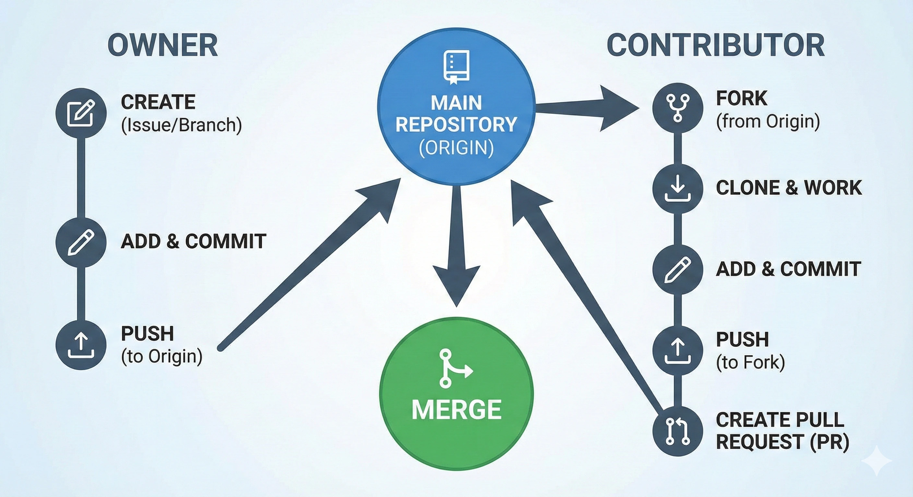

# Contributing to Rail Apprentice to Expert

Thank you for your interest in contributing to the Rail project! We welcome contributions from everyone.

## Getting Started

### Basic Git Commands
Here are the minimum commands you need to know to work with this repository:

- **Pull latest changes**: `git pull origin main`
- **Check status**: `git status`
- **Add files**: `git add .` (adds all changes) or `git add <filename>`
- **Commit changes**: `git commit -m "Description of changes"`
- **Push changes**: `git push origin main`
- **Merge changes**: `git merge <branch_name>` (if working with branches)




### Editing Files
You can edit files using any text editor or IDE.
- **Simple**: Notepad (Windows), TextEdit (Mac).
- **Recommended**: [Visual Studio Code (VS Code)](https://code.visualstudio.com/). It has great integration with Git and GitHub.

**Learn More:**
- [Video: How to use GitHub with VS Code](https://www.youtube.com/watch?v=i_23KUAEtUM)

## Local Development (Ruby & Jekyll)

This project is built using **Ruby**, **Markdown**, **Latex** and **Jekyll**.

### Prerequisites
1.  Install [Ruby](https://www.ruby-lang.org/en/documentation/installation/).
2.  Install [Jekyll](https://jekyllrb.com/docs/installation/).

### Running Locally
To preview the site on your computer:
1.  Open your terminal/command prompt in the project folder.
2.  Install dependencies:
    ```bash
    bundle install
    ```
3.  Run the server:
    ```bash
    bundle exec jekyll serve
    ```
4.  Open your browser and go to `http://localhost:4000`.

## Basic commands

### Markdown Formatting Guide

#### Text & Formatting
- **Bold**: `**text**` or `__text__`
- **Italic**: `*text*` or `_text_`
- **Bold & Italic**: `***text***`

#### Headings
```markdown
# Heading 1
## Heading 2
### Heading 3
```

#### Lists
**Bullet points:**
```markdown
- Item 1
- Item 2
    - Nested item
```

**Numbered lists:**
```markdown
1. First item
2. Second item
     1. Nested item
```

#### Tables
```markdown
| Column 1 | Column 2 |
|----------|----------|
| Data 1   | Data 2   |
```

#### Links & Media
- **Hyperlink**: `[Link text](https://example.com)`
- **Image**: `` Prefered image is . 
- **YouTube**: Embed using HTML:
    ```html
    <iframe width="560" height="315" src="https://www.youtube.com/embed/VIDEO_ID" frameborder="0" allowfullscreen></iframe>
    ```

#### LaTeX Formulas
- **Inline**: `$E = mc^2$`
- **Block**:
    ```markdown
    $$
    \int_{a}^{b} f(x) dx
    $$
    ```

#### Code Blocks
**Inline code**: `` `code` ``

**Block**:
````markdown
```python
def hello():
        print("Hello World")
```
````

#### Notes/Callouts
```markdown
> **Note:** This is a note or callout.
```


## Want to Learn More?

The commands above are the minimum needed. If you want to dive deeper:
- [Extended Markdown with Just the Docs](https://just-the-docs.com/docs/ui-components/typography/)
- [GitHub Git Cheatsheet](https://docs.github.com/en/get-started/git-basics/git-cheatsheet)
- [Video: Git and GitHub for Beginners](https://www.youtube.com/watch?v=RGOj5yH7evk)

## Alternative Editing Methods

If you don't want to set up a local environment, you can:

1.  **Edit on GitHub**: Navigate to a file on GitHub and click the pencil icon to edit directly in your browser.
2.  **Google Colab (for Notebooks)**: If you are working with Jupyter Notebooks, you can use [Google Colab](https://colab.research.google.com/) to open and edit them. (Note: This might be the "Google Jules" tool you were thinking of for pulling and editing notebooks).

## Project Structure & Tools

- **Template**: We use the [Just the Docs](https://just-the-docs.com/) theme. Please refer to their documentation for formatting and configuration options.
- **Content**: We support standard Markdown (`.md`), Python scripts (`.py`), and Jupyter Notebooks (`.ipynb`) for sharing code and analysis.

## Pull Requests & Issues

### Reporting Issues
If you find a bug or have a suggestion, please open an Issue in the repository. Describe the problem clearly and include steps to reproduce it if possible.

### Submitting Pull Requests
When submitting a Pull Request (PR):
1.  **Description**: Clearly explain **what** you changed and **why**.
2.  **Screenshots**: If you changed the UI or added a new page, please include a screenshot.
3.  **Link Issues**: If this PR fixes an issue, link it (e.g., "Fixes #123").

Thanks for Joining!

